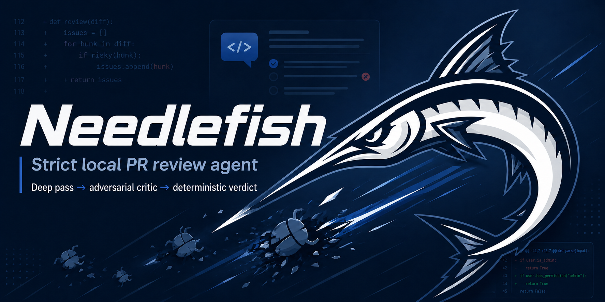

<p align="center">
  
</p>

# needlefish

Strict local PR review agent. Acts like a senior engineer reviewing your diff
before merge — only real defects (bugs, regressions, security, data loss,
migration/upgrade risk, missing validation, duplicate behavior), never style.

Read-only by default. Small PRs use a review pass plus an adversarial critic;
large PRs use map/deep passes before the same critic. Codex is the default
runner; Claude Code, opencode, OpenAI-compatible HTTP, Grok, and ACP agents are
also supported. Verdict is derived deterministically from the surviving
findings, never freehanded by the model.

## Install

From inside any git repo you want reviewed:

```bash
npx needlefish
```

Requires Node 20+ and at least one authed runner CLI on `PATH`. Needlefish
auto-detects `codex`, then `claude`, then `opencode`. Pass `--runner` or set
`NEEDLEFISH_RUNNER` when you want a specific runner.

## GitHub Action quick start

Add `.github/workflows/needlefish.yml` to your repo:

```yaml
name: needlefish
on:
  pull_request:
    types: [opened, synchronize, reopened]
permissions:
  contents: read
  pull-requests: write
  checks: write
jobs:
  review:
    if: github.event.pull_request.head.repo.full_name == github.repository
    runs-on: ubuntu-latest
    steps:
      - uses: actions/checkout@v4
        with:
          fetch-depth: 0
      - uses: frankekn/needlefish@v0
        env:
          CODEX_AUTH_JSON: ${{ secrets.CODEX_AUTH_JSON }}
```

Set one secret — `CODEX_AUTH_JSON` (the contents of a logged-in codex CLI's
`~/.codex/auth.json`) or `CODEX_API_KEY` — and open a PR. Findings arrive as
inline review comments anchored to the diff; pushes update the same review
in place (fresh / still-open / resolved) instead of stacking new ones.

Cost: 2 model calls per review on small PRs (~48s at the default `medium`
effort), 1 map + N deep calls + 1 critic on large ones. Docs-only PRs and
unchanged heads skip the model entirely. Maintainers can comment
`@needlefish recheck` or `@needlefish explain <finding>` on the PR.

## Development install

Requires:

- Node 20+
- Corepack (recommended) or the pinned pnpm from `packageManager`
- One supported model CLI authed locally: Codex, Claude Code, or opencode
- GitHub CLI (`gh`) for `--pr`, `pr`, and GitHub Action mode

```bash
git clone https://github.com/frankekn/needlefish
cd needlefish
PNPM_VERSION=$(node -p "require('./package.json').packageManager")
corepack enable
corepack prepare "$PNPM_VERSION" --activate
pnpm install --frozen-lockfile
```

If Corepack is unavailable, install the package manager pinned in
`package.json`:

```bash
PNPM_VERSION=$(node -p "require('./package.json').packageManager")
npm exec --yes --package "$PNPM_VERSION" -- pnpm install --frozen-lockfile
```

### Make the development shim resolve on PATH (optional)

The repo keeps a `bin/needlefish` development shim. After clone, symlink it
onto a directory that's on your PATH so you can invoke `needlefish` from any
cwd/shell:

```bash
ln -sf "$PWD/bin/needlefish" ~/.local/bin/needlefish   # or any PATH dir
needlefish --version
```

The shim resolves symlinks and runs the repo-local `tsx` against `src/cli.ts`,
so it survives the repo being linked from elsewhere and works in non-interactive
shells (unlike a shell alias). Without this step, invoke via the full path below.

## Local use (read-only, no GitHub writes)

Run from inside any repo you want reviewed, on a branch with changes:

```bash
# One-line package install/run:
cd /path/to/some-repo
npx needlefish

# If the development shim is linked (above), from inside the target repo:
needlefish

# Otherwise, full path (cwd is the target):
/path/to/needlefish/node_modules/.bin/tsx /path/to/needlefish/src/cli.ts

# Uncommitted code (no branch/PR needed): if the working tree is dirty —
# or the repo has no commits yet — `needlefish` reviews your uncommitted
# changes, untracked files included. Not a git repo yet? Run `git init` first.
needlefish --repo /path/to/some-repo --uncommitted  # force working-tree review
needlefish --repo /path/to/some-repo --branch       # force merge-base..HEAD review

# Local diff review of committed work. Point at the target with --repo from anywhere:
needlefish --repo /path/to/some-repo --focus security
needlefish --repo /path/to/some-repo --deep
needlefish --repo /path/to/some-repo --pr 123  # attaches PR metadata to the local diff
needlefish --repo /path/to/some-repo --base develop

# PR ref review from any branch:
needlefish pr 123 --repo /path/to/some-repo

# Runner selection:
needlefish --repo /path/to/some-repo --runner claude
needlefish --repo /path/to/some-repo --runner opencode --model zai-coding-plan/glm-5.2
NEEDLEFISH_ACP_BIN=/path/to/acp-agent needlefish --repo /path/to/some-repo --runner acp
```

Output: Markdown to stdout, JSON saved to `~/.cache/needlefish/<repo>/last-review.json`.
Pass `--json` to print the same `ReviewResult` JSON to stdout instead:

```bash
needlefish --repo . --json | jq .verdict
```

## Machine interface

`needlefish --repo <path> --json` and `needlefish pr <number> --json` print a
versioned `ReviewResult` JSON object to stdout. The local cache stores the same
serialized object at `~/.cache/needlefish/<repo>/last-review.json`.

Within a `schemaVersion`, fields are only added, never changed or removed.
Breaking shape changes require a new `schemaVersion` and changelog entry.

| Field | Shape |
| --- | --- |
| `schemaVersion` | Literal `1`. |
| `verdict` | `pass`, `needs_human`, or `changes_requested`. |
| `reviewTarget` | Optional review target string. |
| `findings[]` | Finding objects with `severity`, `title`, `category`, `file`, `lineStart`, `lineEnd`, `confidence`, `whyItBreaks`, `suggestedFix`, and `validation`. |
| `findings[].consumerFile` | Optional downstream file affected by the finding. |
| `findings[].consumerLine` | Optional downstream line affected by the finding. |
| `residualRisks[]` | Residual-risk objects with `text` and `blocks`. |
| `checked[]` | Evidence strings describing what the review examined. |
| `stats` | Optional per-runner-call timing and attempt stats. |
| `totalDurationMs` | Optional total review duration in milliseconds. |

## Base detection

`--base` → `origin/HEAD` → `main`. Pass `--base <ref>` to override.

## GitHub Action mode (self-hosted runner)

`needlefish --github --pr N` collects the PR via `gh api`, runs the same core,
and posts a non-sticky `COMMENT` review with the full rendered review body plus
the authoritative `Needlefish` check-run. Verdict → surface mapping:

| verdict              | review event        | check     |
| -------------------- | ------------------- | --------- |
| pass                 | COMMENT             | success   |
| changes_requested    | COMMENT             | failure   |
| needs_human          | COMMENT             | neutral   |
| run failed           | (none)              | failure   |

All verdict reviews are `COMMENT`, not approval or blocking-review events. The
`GITHUB_TOKEN` bot is not permitted to formally approve PRs, and sticky blocking
reviews can outlive a fixed head. The check-run is the merge gate: a failed
review never passes a PR because the check goes `failure`.

When a finding includes a validated exact replacement, its inline comment adds
a native GitHub suggestion block; failed validation falls back to the normal
comment without a suggestion.

The reusable workflow skips closed or forked `pull_request` events before the
self-hosted job starts. Manual and reusable dispatch resolve PR metadata first,
then skip closed or forked PRs before checkout or model invocation. Before
posting any result, the CLI re-reads the PR and skips output if the PR closed or
the head SHA moved.

### Runner setup (one-time)

Target repos consume needlefish by **calling the reusable workflow** in this
repo. Add a thin caller in the target repo (e.g. `.github/workflows/needlefish.yml`):

```yaml
name: needlefish
on:
  pull_request:
    types: [opened, synchronize, reopened]
  workflow_dispatch:
    inputs:
      pr_number: { description: PR number to review (manual trigger), required: true }
permissions:
  contents: read
  pull-requests: write
  checks: write
jobs:
  review:
    uses: frankekn/needlefish/.github/workflows/review.yml@main
    with:
      pr_number: ${{ github.event.inputs.pr_number || github.event.pull_request.number }}
      # Optional:
      # runner: codex
      # model: gpt-5.5
      # codex_reasoning_effort: high
      # timeout_ms: "600000"
    secrets: inherit
```

Because the caller pins `@main`, fixes to needlefish's `review.yml` propagate to
every target repo automatically. The runner must have needlefish deployed at
`~/.local/bin/needlefish`; the workflow does not reinstall the tool on every PR.
Hardened installed releases should also publish
`~/.local/share/needlefish/current/release.json` with the installed Needlefish
SHA so review jobs can fail before spending model tokens when a runner is stale.

1. Register a **self-hosted runner** on the target repo (free, unlimited minutes).
   Keep it on a machine you control (EC2/pod/Mac).
2. Deploy needlefish once on that runner. Future pushes to `main` run
   `needlefish-deploy` and update the runner automatically:
   ```bash
   ssh termtek@ubuntu 'sh -s' < scripts/deploy-ubuntu.sh
   ```
   For a fleet, dispatch the same release SHA to all six selected runners and
   verify each runner reports the same installed metadata before trusting the
   fleet.
3. Ensure the runner has `gh` and the selected model CLI on `PATH`.
4. On that runner, auth the selected CLI once. For Codex:
   ```bash
   printf '%s' "$CODEX_API_KEY" | codex login --with-api-key -c 'service_tier="fast"'
   ```
5. If needlefish is **private**, the caller repo must be allowed to call this
   reusable workflow; otherwise (public) the default `GITHUB_TOKEN` is enough.
6. **Runner global-instructions caveat:** model CLIs may auto-load global
   instructions from the runner's home directory. needlefish instructs the model
   to ignore anything outside the target repo's `AGENTS.md` as policy, but if
   you want zero leakage, keep the runner home free of unrelated instruction
   files.

> Self-hosted runners execute PR code on your machine. Fine for solo use on your
> own repos; if you ever open PRs to outside contributors, isolate the runner
> (ephemeral container) so contributor code can't touch your persistent host.

## GitHub Action (hosted, any repo)

No self-hosted runner required: this repo doubles as a composite action that
runs on GitHub-hosted `ubuntu-latest`. Add a workflow to the target repo:

```yaml
name: needlefish
on:
  pull_request:
    types: [opened, synchronize, reopened]
permissions:
  contents: read
  pull-requests: write
  checks: write
jobs:
  review:
    # Fork PRs don't receive secrets; skip them instead of failing at model auth.
    if: github.event.pull_request.head.repo.full_name == github.repository
    runs-on: ubuntu-latest
    steps:
      - uses: actions/checkout@v4
        with:
          fetch-depth: 0 # full history: needlefish needs the merge base
      - uses: frankekn/needlefish@v0
        env:
          CODEX_AUTH_JSON: ${{ secrets.CODEX_AUTH_JSON }}
```

Runner authentication (repo secrets, passed via `env` on the action step):

| runner   | secret(s)                                                |
| -------- | -------------------------------------------------------- |
| codex    | `CODEX_AUTH_JSON` (contents of a logged-in `~/.codex/auth.json`) or `CODEX_API_KEY` |
| claude   | `ANTHROPIC_API_KEY`                                       |
| opencode | provider key for the chosen model (e.g. `OPENAI_API_KEY`) |
| openai   | `OPENAI_API_KEY`                                          |
| grok     | Grok CLI auth or provider-specific key                    |
| acp      | agent-specific auth plus `NEEDLEFISH_ACP_BIN` on the runner |

Inputs (all optional): `pr_number` (defaults to the event PR), `runner`
(default `codex`), `model`, `timeout_ms`, `codex_reasoning_effort`,
`runner_version` (npm version of the runner CLI), `repo_path` (defaults to the
workspace checkout), `github_token` (defaults to the workflow token).

Cost and behavior notes:

- Small PRs use 2 model calls per PR (review + critic), about 48s at the
  default `medium` effort. Large PRs use 1 map call + N deep calls
  (concurrency 3 by default) + 1 critic. Docs-only PRs use 0 model calls.
  Same-head re-runs use 0 model calls unless forced with `--recheck`.
- Fork PRs don't receive secrets by default. The `if:` gate above skips them.
  `pull_request_target` would hand secrets to workflows triggered by fork
  code — avoid it unless you fully understand the exposure.
- The hosted path cold-starts on every run (pnpm install + runner CLI
  install, roughly a minute). The self-hosted path above stays the
  low-latency option.

## Model runner invocation

`src/shared/codex.ts` invokes the selected runner. Use `--runner`, `--model`,
and `--timeout-ms`, or the matching env vars:

| option | env | default |
| --- | --- | --- |
| runner | `NEEDLEFISH_RUNNER` | auto-detects `codex`, then `claude`, then `opencode` |
| model | `NEEDLEFISH_MODEL` | runner default |
| Codex reasoning effort | `CODEX_REASONING_EFFORT` | `medium` |
| timeout | `NEEDLEFISH_TIMEOUT_MS` | `600000` |

Runner-specific binary env vars are `CODEX_BIN`, `CLAUDE_BIN`, `OPENCODE_BIN`,
`GROK_BIN`, and `NEEDLEFISH_ACP_BIN`. `NEEDLEFISH_ACP_BIN` is required for the
`acp` runner. Existing `CODEX_MODEL`, `CODEX_TIMEOUT_MS`, and `CODEX_RETRY_MS`
still work for Codex compatibility.

When neither `--runner` nor `NEEDLEFISH_RUNNER` is set and none of `codex`,
`claude`, or `opencode` can be found, Needlefish exits with install commands
for those three CLIs instead of a stack trace.

Codex runs with `--ignore-user-config -c model_reasoning_effort="<effort>" -s
read-only`. `medium` is the default; set `CODEX_REASONING_EFFORT=high` to
restore the old default, or `xhigh` for the highest-effort mode. Claude Code runs with
`--permission-mode plan`, `--safe-mode`, and no session persistence. opencode
runs with `--pure` and never uses `--dangerously-skip-permissions`. ACP runs a
JSON-RPC 2.0 Agent Client Protocol process over stdio from `NEEDLEFISH_ACP_BIN`;
Needlefish sends `session/cancel` on timeout, then applies the same process-group
kill path as the CLI runners. Closed PRs are skipped before diffing or model
invocation. Non-Codex runners execute inside a throwaway clean clone at the
review head commit;
needlefish checks that sandbox with
`git status --porcelain --untracked-files=all --ignored=matching` and verifies
`HEAD` did not move after each successful model call.

### Runner subprocess environment

Runner CLIs (`codex`, `claude`, `opencode`, `grok`, `acp`) are spawned with an
allowlisted environment, not the full parent `process.env` — only
locale/proxy/path basics plus each runner's own `_BIN`/`_MODEL`-style
variables are passed through. To pass an additional variable to the runner
subprocess, set `NEEDLEFISH_RUNNER_ENV_PASSTHROUGH=VAR1,VAR2` (comma-separated
names).

## Verdict derivation (deterministic)

- any P0 / P1 / P2 finding → `changes_requested`
- otherwise a blocking residual risk → `needs_human`
- otherwise → `pass`

P3-only findings are reported but do not block (check stays green).

## Status

v0.3. Read-only. Shipped: inline review comments, sticky re-review
(fresh/open/resolved across pushes), `@needlefish recheck` / `@needlefish
explain` maintainer commands, docs-only fast path (no model calls),
same-head dedupe, hosted-runner repo inspection (best-effort AppArmor
sysctl). `--fix` stays unimplemented by design.
