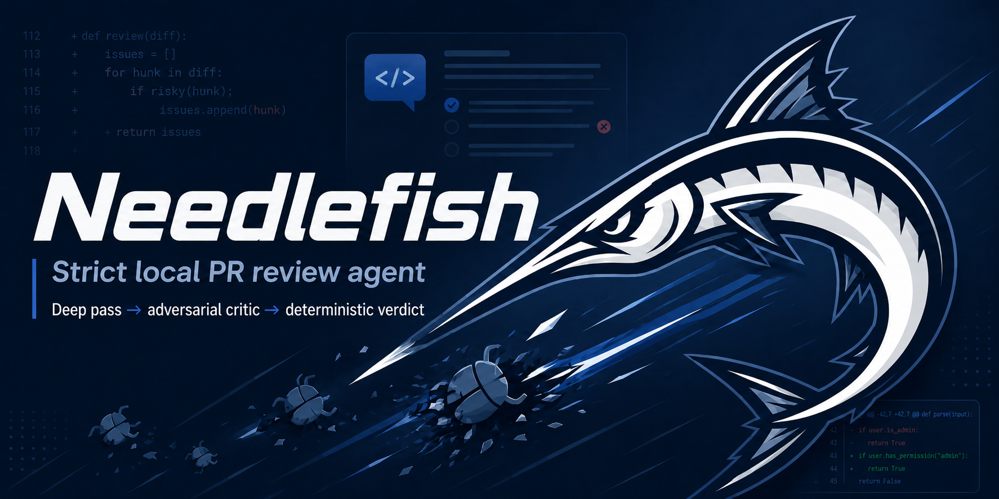

<p align="center">
  
</p>

# needlefish（繁體中文）

[English](README.md) | 繁體中文

> 嚴格、本機、唯讀的 PR 審查：像資深工程師一樣，只標記真正的缺陷，其餘保持沉默。

<p align="center">
  <a href="https://www.npmjs.com/package/needlefish"></a>
  =20">
  <a href="LICENSE"></a>
</p>

[Benchmark 頁面原始碼](https://github.com/frankekn/needlefish/blob/main/docs/index.html) · [方法](https://github.com/frankekn/needlefish/blob/main/eval/RESULTS.md) · [GitHub Action](#github-action-快速開始)

Needlefish 會在 merge 前檢查 diff，只回報真正的缺陷：錯誤、回歸、安全性、
資料遺失、遷移／升級風險、缺少驗證或重複行為，不回報單純的風格問題。

**與眾不同之處：**

- **Prefer-zero findings。** 以嚴格資深 reviewer 的標準：不值得在 merge 前
  修的就捨棄。沒有風格挑剔，沒有雜訊。
- **確定性 verdict。** `pass`／`needs_human`／`changes_requested` 由保留下來的
  finding 依固定規則推導，不由模型自由決定。
- **隔離的審查目標。** 審查會在 throwaway clean clone 中執行，並在每次模型
  呼叫後檢查是否遭竄改。
- **有防護的 evals。** 每次 prompt／pipeline 變更上線前，都會用 86 個情境的
  harness（啟用 anti-cheat guards）量測（見 [Benchmarks](#benchmarks)）。

小型 PR 會執行審查與對抗式 critic；大型 PR 會先執行 map／deep 階段，再交給
相同的 critic。Codex 是預設 runner，也支援 Claude Code、opencode、OpenAI
相容 HTTP、Grok、pi 與 ACP。

## 目錄

- [安裝](#安裝)
- [GitHub Action 快速開始](#github-action-快速開始)
- [Benchmarks](#benchmarks)
- [開發環境安裝](#開發環境安裝)
- [本機使用](#本機使用唯讀不會寫入-github)
- [機器介面](#機器介面)
- [基準偵測](#基準偵測)
- [GitHub Action 模式（self-hosted runner）](#github-action-模式self-hosted-runner)
- [GitHub Action（hosted，任何 repo）](#github-actionhosted任何-repo)
- [Model runner 執行方式](#model-runner-執行方式)
- [Verdict 推導](#verdict-推導確定性)
- [狀態](#狀態)

## 安裝

在要審查的 git repo 中執行：

```bash
npx needlefish
```

需要 Node 20 以上，以及至少一個已登入且位於 `PATH` 的 runner CLI。
Needlefish 會依序自動偵測 `codex`、`claude`、`opencode`；要指定 runner，
請傳入 `--runner` 或設定 `NEEDLEFISH_RUNNER`。

## GitHub Action 快速開始

在目標 repo 新增 `.github/workflows/needlefish.yml`：

```yaml
name: needlefish
on:
  pull_request:
    types: [opened, synchronize, reopened]
permissions:
  contents: read
  pull-requests: write
  checks: write
jobs:
  review:
    if: github.event.pull_request.head.repo.full_name == github.repository
    runs-on: ubuntu-latest
    steps:
      - uses: actions/checkout@v4
        with:
          fetch-depth: 0
      - uses: frankekn/needlefish@v0
        env:
          CODEX_AUTH_JSON: ${{ secrets.CODEX_AUTH_JSON }}
```

設定一個 secret：已登入 Codex CLI 的 `~/.codex/auth.json` 內容
（`CODEX_AUTH_JSON`），或 `CODEX_API_KEY`，然後開啟 PR。finding 會以對應
diff 的 inline review comment 發布；後續 push 會更新同一份 review，標示
fresh／still-open／resolved，不會不斷堆疊新 review。

小型 PR 每次審查使用 2 次模型呼叫（預設 `gpt-5.6-terra` @ `xhigh`）；大型 PR 使用
1 次 map、N 次 deep（預設並行數 3）及 1 次 critic。純文件 PR 與未變更的
head 會跳過模型。對此儲存庫具有寫入權限的維護者可以在 PR 留言
`@needlefish recheck` 或 `@needlefish explain <finding>`。

## Benchmarks

[已準備的 benchmark 頁面原始碼](https://github.com/frankekn/needlefish/blob/main/docs/index.html)只回答一個問題：哪一組 model、agent
harness、provider route 與 effort，能抓到真正的 PR 缺陷，又不會阻擋乾淨的
變更？Leaderboard 直接由受防護的 report JSON 產生，不手抄分數。

主要分數採用 Balanced Review Accuracy，也就是 anchored recall 與 usable
specificity 的算術平均；Tier-1 recall 仍是不可繞過的資格門檻。

目前 gate 有 86 個審查情境；每個公開 lane 都完整跑三次，包含 sealed holdout
與 anti-cheat tracing。只有 prompt、fixture-set、scorer 與 anti-cheat hash
都和 production baseline 相同的 report 才能排名。Provider failure 或訂閱尚未
提供的模型只會標為 operational outcome，不會算成模型零分。

頁面尚未部署；在 custom domain 或 GitHub Pages 部署獲得授權前，此連結會刻意
開啟原始碼。

目前部署的 Codex `gpt-5.6-terra` @ `xhigh` 已通過 Tier-1 與 positive-noise
資格門檻。詳見
[時間序實驗記錄](https://github.com/frankekn/needlefish/blob/main/eval/RESULTS.md)與
[raw reports](https://github.com/frankekn/needlefish/tree/main/eval/results)。

## 開發環境安裝

需要：

- Node 20 以上
- Corepack（建議）或 `package.json` 指定的 pnpm
- 一個已登入的模型 CLI：Codex、Claude Code 或 opencode
- GitHub CLI（`gh`，供 `--pr`、`pr` 與 GitHub Action 模式使用）

```bash
git clone https://github.com/frankekn/needlefish
cd needlefish
PNPM_VERSION=$(node -p "require('./package.json').packageManager")
corepack enable
corepack prepare "$PNPM_VERSION" --activate
pnpm install --frozen-lockfile
```

若沒有 Corepack：

```bash
PNPM_VERSION=$(node -p "require('./package.json').packageManager")
npm exec --yes --package "$PNPM_VERSION" -- pnpm install --frozen-lockfile
```

### （選用）讓開發 shim 位於 PATH

repo 內含 `bin/needlefish` 開發 shim。可將它連結到 PATH 內的目錄：

```bash
ln -sf "$PWD/bin/needlefish" ~/.local/bin/needlefish
needlefish --version
```

shim 會解析 symlink，使用 repo 內的 `tsx` 執行 `src/cli.ts`，也適用於非
互動 shell。不做此步驟時，請使用完整路徑呼叫。

## 本機使用（唯讀，不會寫入 GitHub）

在有變更的目標 repo 中執行：

```bash
# 套件安裝／執行
cd /path/to/some-repo
npx needlefish

# 已建立開發 shim 時
needlefish

# 尚未建立 shim 時
/path/to/needlefish/node_modules/.bin/tsx /path/to/needlefish/src/cli.ts

# 審查未提交變更（dirty worktree 或尚無 commit 時預設也會如此）
needlefish --repo /path/to/some-repo --uncommitted
needlefish --repo /path/to/some-repo --branch

# 審查已提交的 diff
needlefish --repo /path/to/some-repo --focus security
needlefish --repo /path/to/some-repo --deep
needlefish --repo /path/to/some-repo --pr 123
needlefish --repo /path/to/some-repo --base develop

# 從任意 branch 審查 PR ref
needlefish pr 123 --repo /path/to/some-repo

# 指定 runner
needlefish --repo /path/to/some-repo --runner claude
needlefish --repo /path/to/some-repo --runner opencode --model zai-coding-plan/glm-5.2
NEEDLEFISH_ACP_BIN=/path/to/acp-agent needlefish --repo /path/to/some-repo --runner acp
```

Markdown 會輸出到 stdout；JSON 會儲存於
`~/.cache/needlefish/<repo>/last-review.json`。使用 `--json` 可輸出相同的
`ReviewResult`：

```bash
needlefish --repo . --json | jq .verdict
```

## 機器介面

`needlefish --repo <path> --json` 與 `needlefish pr <number> --json` 會輸出
帶版本的 `ReviewResult` JSON。`schemaVersion` 內只新增欄位，不修改或移除
既有欄位；破壞性變更需要新的 `schemaVersion` 與 changelog。

主要欄位：

| 欄位 | 說明 |
| --- | --- |
| `schemaVersion` | 固定為 `1`。 |
| `verdict` | `pass`、`needs_human` 或 `changes_requested`。 |
| `reviewTarget` | 選用的審查目標字串。 |
| `findings[]` | 含嚴重度、標題、分類、檔案、行號、信心度、原因、修正與驗證。 |
| `residualRisks[]` | 含 `text` 與 `blocks` 的殘餘風險。 |
| `checked[]` | 審查過的證據字串。 |
| `stats` | 選用的 runner 呼叫時間與嘗試次數。 |
| `totalDurationMs` | 選用的總審查時間（毫秒）。 |

## 基準偵測

`--base` → `origin/HEAD` → `main`。用 `--base <ref>` 覆寫。

## GitHub Action 模式（self-hosted runner）

`needlefish --github --pr N` 會透過 `gh api` 取得 PR，執行相同的核心流程，
並發布非 sticky 的 `COMMENT` review 與權威的 `Needlefish` check-run：

| verdict | review event | check |
| --- | --- | --- |
| pass | COMMENT | success |
| changes_requested | COMMENT | failure |
| needs_human | COMMENT | neutral |
| run failed | 無 | failure |

所有 verdict review 都是 `COMMENT`，不是 approval 或 blocking-review event。
check-run 才是 merge gate。有效且精確的 replacement 會轉成原生 GitHub
suggestion；驗證失敗時會退回一般 comment。

Reusable workflow 會在 self-hosted job 啟動前跳過 closed 或 forked PR；發布
結果前也會重新讀取 PR，若 head SHA 改變或 PR 已關閉，就不輸出結果。

### Runner 設定（一次性）

目標 repo 透過 reusable workflow 呼叫本 repo：

```yaml
jobs:
  review:
    uses: frankekn/needlefish/.github/workflows/review.yml@main
    with:
      pr_number: ${{ github.event.inputs.pr_number || github.event.pull_request.number }}
      # 可選；預設 codex + gpt-5.6-terra
      # runner: codex
      # model: gpt-5.6-terra
      # codex_reasoning_effort: xhigh
      # timeout_ms: "600000"
      # idle_timeout_ms: "600000" # 僅 opencode
    secrets: inherit
```

要使用 Grok 4.5，將 runner 與 model 設為 `grok` 與 `grok-4.5`。runner
必須已有登入的 `grok` CLI 且位於 `PATH`；workflow 不會安裝或登入該 CLI。

一次性手動審查：

```bash
PR_NUMBER=123 # 替換為 PR 編號
gh workflow run review.yml -R frankekn/needlefish --ref main \
  -f pr_number="$PR_NUMBER" -f runner=grok -f model=grok-4.5
```

所有 production model runner 都不套用各 runner 自己的 process-level 權限限制，
因此只能在你控制的 self-hosted runner 上使用。

需要可重現的 review 時，reusable workflow ref 與
`needlefish_release_sha` 必須 pin 到同一個完整 commit SHA。workflow 會直接執行
`~/.local/share/needlefish/releases/<sha>` 的 immutable release；即使較新的部署
切換了共用的 `current` symlink，已 pin 的 repo 也不受影響。未指定 release SHA
時，workflow 會解析 `needlefish_repo` 當前的 `main` SHA。PR job
不會重新安裝 Needlefish，因此該 release 必須已部署在 runner。

```yaml
jobs:
  review:
    uses: frankekn/needlefish/.github/workflows/review.yml@<full-commit-sha>
    with:
      needlefish_release_sha: <full-commit-sha>
```

1. 在目標 repo 註冊 self-hosted runner，並限制在自己控制的機器。
2. 在 runner 部署 Needlefish；`main` 的 push 會觸發 `needlefish-deploy`：
   ```bash
   ssh termtek@ubuntu 'sh -s' < scripts/deploy-ubuntu.sh
   ```
   目前 production fleet 是一份共用 x64 安裝，加上一份由兩個 runner service
   共用的 ARM 安裝。兩份安裝都要部署相同 release SHA，並確認 installed
   metadata 一致。
3. 確認 `gh` 與選定的模型 CLI 位於 `PATH`。
4. Codex fleet 固定使用 `@openai/codex@0.153.0`；以 runner service account
   安裝並確認版本：
   ```bash
   npm install -g @openai/codex@0.153.0
   codex --version
   ```
   Codex job 執行時注入 `CODEX_PROXY_BASE_URL`、`CODEX_PROXY_API_KEY` 與
   `NEEDLEFISH_CODEX_PROXY_REQUIRED=1`。Needlefish 會在命令列註冊
   `cliproxyapi` custom provider，但 credential 只存在子程序環境；required
   模式缺少任一設定會直接失敗，不會退回 OAuth，且 proxy invocation 不帶
   direct subscription 的 `service_tier` override。Grok 則依 provider 完成
   CLI 登入或 key 設定，並確認 `grok` 可執行。
5. 若 Needlefish 是 private repo，caller repo 必須被允許呼叫 reusable workflow。
6. 模型 CLI 可能讀取 runner home 的 global instructions。若要避免外部指令
   混入，請保持 runner home 沒有不相關的 instruction 檔案。

> Self-hosted runner 會在你的機器上執行 PR code。若接受外部 contributor，
> 請改用 ephemeral container 隔離持久化主機。

## GitHub Action（hosted，任何 repo）

此 repo 也提供在 GitHub-hosted `ubuntu-latest` 執行的 composite action。
hosted action 的安裝步驟只接受 `codex`、`claude`、`opencode` 或 `pi`。
Grok CLI 不在其中；要使用 Grok 4.5，請使用上方的 self-hosted reusable
workflow。對 hosted action 傳入 `runner: grok`（或 `openai`／`acp`）會在
安裝步驟失敗。

```yaml
name: needlefish
on:
  pull_request:
    types: [opened, synchronize, reopened]
permissions:
  contents: read
  pull-requests: write
  checks: write
jobs:
  review:
    if: github.event.pull_request.head.repo.full_name == github.repository
    runs-on: ubuntu-latest
    steps:
      - uses: actions/checkout@v4
        with:
          fetch-depth: 0
      - uses: frankekn/needlefish@v0
        env:
          CODEX_AUTH_JSON: ${{ secrets.CODEX_AUTH_JSON }}
```

Hosted action 只會安裝 `action.yml` 列出的 runner；Grok CLI 不在其中。要
使用 Grok 4.5，請使用上方的 self-hosted reusable workflow。

`runner_version` 可覆寫所選 runner CLI 的 npm 版本。未設定時，action 會安裝
`action.yml` 裡的 per-runner pin（目前 Codex `0.153.0`、Claude `2.1.239`、
OpenCode `1.18.21`、pi `0.70.6`）。只有在你刻意要偏離 pin 時才傳入明確版本
（或 `latest`）。四個套件無法共用一個正確的預設值，所以 pin 依 `runner`
選擇。

hosted action 能安裝的 runner，其認證方式（repo secrets，透過 action step 的
`env` 傳入）：

| runner | secret／認證 |
| --- | --- |
| codex | `CODEX_AUTH_JSON`（已登入的 `~/.codex/auth.json` 內容）或 `CODEX_API_KEY` |
| claude | `ANTHROPIC_API_KEY` |
| opencode | 所選模型的 provider key，例如 `OPENAI_API_KEY` |
| pi | `PI_AUTH_JSON`（已登入的 `~/.pi/agent/auth.json` 內容） |

claude 的 `ANTHROPIC_API_KEY`、`CLAUDE_CODE_OAUTH_TOKEN` 與 opencode 的
`OPENAI_API_KEY` 會進入 runner subprocess allowlist；其他 provider 的 key
需設定 `NEEDLEFISH_RUNNER_ENV_PASSTHROUGH=VAR`（見「Runner subprocess 環境」）。

`grok` 屬於 self-hosted lane（runner `PATH` 上需有已登入的 `grok` CLI）。
`acp`（`NEEDLEFISH_ACP_BIN`）也是 CLI runner。`openai` 是 HTTP，不是 CLI
（`OPENAI_API_KEY` 加上 `--model`／`OPENAI_MODEL`）。hosted action 不會安裝
上述任何一個。

輸入（皆可選）：`pr_number`（預設為事件 PR）、`runner`（預設 `codex`）、
`model`、`timeout_ms`、`codex_reasoning_effort`、`runner_version`（要安裝的
runner CLI npm 版本）、`repo_path`（預設為 workspace checkout）、
`github_token`（預設為 workflow token）。

Fork PR 預設不會收到 secrets，workflow 會跳過它們；不要在不了解風險前使用
`pull_request_target`，因為它會把 secrets 交給由 fork code 觸發的 workflow。

composite action 不會把 PR 留言指令加進 consumer repo。本 repo 的
`.github/workflows/commands.yml` 會監聽維護者（僅 OWNER／MEMBER／
COLLABORATOR）的 `@needlefish recheck` 與 `@needlefish explain <finding>`
留言。recheck 會 dispatch 本 repo 的 `review.yml`；explain 在已部署
`~/.local/bin/needlefish` 的 self-hosted runner 上執行 `needlefish explain`。
把該檔案複製到其他 repo 之前，必須改寫這兩個 job 的目標。

## Model runner 執行方式

`--runner`／`NEEDLEFISH_RUNNER` 可為 `codex`、`claude`、`opencode`、`openai`、
`grok`、`pi` 或 `acp`。可使用 `--runner`、`--model`、`--timeout-ms`，或相同的
環境變數：

| 選項 | 環境變數 | 預設 |
| --- | --- | --- |
| runner | `NEEDLEFISH_RUNNER` | 自動偵測 `codex`，然後 `claude`，然後 `opencode` |
| model | `NEEDLEFISH_MODEL` | runner 預設值 |
| Codex reasoning effort | `CODEX_REASONING_EFFORT` | `medium`（composite action 與 reusable workflow：`gpt-5.6-terra` 時為 `xhigh`） |
| timeout | `NEEDLEFISH_TIMEOUT_MS` | `600000` |
| opencode idle timeout | `OPENCODE_IDLE_TIMEOUT_MS` | per-call timeout 與 `600000` 中較小者 |

opencode CLI 每次產生 stdout 或 stderr 都會重設 idle deadline。若 provider
stream 停止輸出，Needlefish 會終止該 attempt 並使用既有 runner retry，不再等待
被拉長的完整 per-call timeout。

各 runner 的環境變數。CLI runner 的 binary／model／所列認證變數在該
runner 的 subprocess allowlist 內。`openai` runner 是 HTTP，在 process 內
讀取環境變數（subprocess allowlist 為空）。括號內是未設定 `*_BIN` 時使用的
執行檔名：

| runner | binary | model／其他 |
| --- | --- | --- |
| `codex` | `CODEX_BIN`（`codex`） | `CODEX_MODEL`、`CODEX_TIMEOUT_MS`、`CODEX_RETRY_MS`、`CODEX_REASONING_EFFORT`；proxy `CODEX_PROXY_BASE_URL`、`CODEX_PROXY_API_KEY`、`NEEDLEFISH_CODEX_PROXY_REQUIRED=1` |
| `claude` | `CLAUDE_BIN`（`claude`） | `CLAUDE_MODEL`；認證 `ANTHROPIC_API_KEY`、`CLAUDE_CODE_OAUTH_TOKEN` |
| `opencode` | `OPENCODE_BIN`（`opencode`） | `OPENCODE_MODEL`；認證 `OPENAI_API_KEY` |
| `grok` | `GROK_BIN`（`grok`） | `GROK_MODEL` |
| `pi` | `PI_BIN`（`pi`） | `PI_MODEL`、`PI_PROVIDER`（預設 `openai-codex`）、`PI_AUTH_MODE`（`oauth` 或 `proxy`；`openai-codex` 預設 OAuth，明確指定 provider 時預設 proxy） |
| `acp` | `NEEDLEFISH_ACP_BIN`（必填） | — |
| `openai` | 無（HTTP，不是 CLI） | `OPENAI_API_KEY`（必填）、`--model`／`OPENAI_MODEL`（必填）、`OPENAI_BASE_URL`（預設 `https://api.openai.com/v1`） |

若未指定 `--runner` 或 `NEEDLEFISH_RUNNER`，且找不到 `codex`、`claude`、
`opencode`，Needlefish 會輸出這三個 CLI 的安裝指令後結束，而不是 stack
trace。自動偵測不會尋找 `grok`、`pi`、`openai` 或 `acp`。

Codex 使用 `--ignore-user-config --ignore-rules
--dangerously-bypass-approvals-and-sandbox`，避免檢查命令遭 execpolicy rule、
approval prompt 或 host sandbox 阻擋。Needlefish 仍會把它放在 throwaway clean
clone 內執行、移除 GitHub token、固定預期 `HEAD`，並拒絕任何 worktree 變更。
`medium` 是預設；設 `CODEX_REASONING_EFFORT=high` 可恢復舊預設，`xhigh` 為
最高 effort。Claude 使用 `--dangerously-skip-permissions`、`--safe-mode`、
`--no-session-persistence`。Grok 使用 `--always-approve --permission-mode
bypassPermissions --no-plan --sandbox off`。opencode 使用 `--auto` headless
mode，並以 inline `permission: "allow"` 覆寫 global 與 build-agent 權限。pi
使用 `--no-session --mode text --provider openai-codex --thinking <level>`
與預設完整 toolset。這些 production runner 都不需要額外的 unsandboxed
opt-in。ACP 透過 `NEEDLEFISH_ACP_BIN` 使用 JSON-RPC 2.0 stdio process，
timeout 時會先送 `session/cancel` 再終止 process group。

所有 CLI runner 都會在 review head 的 throwaway clean clone 中執行；每次成功
呼叫後都會以
`git status --porcelain --untracked-files=all --ignored=matching`
確認 clone 沒有未提交變更，並驗證 `HEAD` 沒有移動。

### Runner subprocess 環境

CLI runner（`codex`、`claude`、`opencode`、`grok`、`pi`、`acp`）只會收到
allowlist 環境，不會繼承完整的 parent `process.env`——僅 locale／proxy／path
基礎變數加上各 runner 自己的 `_BIN`／`_MODEL` 類變數。若要額外傳遞變數，
設定：

```bash
NEEDLEFISH_RUNNER_ENV_PASSTHROUGH=VAR1,VAR2
```

GitHub Actions 的非機密 `RUNNER_TRACKING_ID` job marker 會自動保留，讓
self-hosted runner 在 job 被取消時能終止 detached model process。

ACP 認證還需要宣告 `NEEDLEFISH_ACP_AUTH_ENV_VARS`，並把相同名稱放入
`NEEDLEFISH_RUNNER_ENV_PASSTHROUGH`，例如
`NEEDLEFISH_ACP_AUTH_ENV_VARS=MY_AGENT_TOKEN` 搭配
`NEEDLEFISH_RUNNER_ENV_PASSTHROUGH=MY_AGENT_TOKEN`。任意 passthrough 設定
本身不能證明已認證。或者以 `NEEDLEFISH_ACP_AUTH_FILES` 指定要複製到
disposable HOME 的 HOME-relative credential files。

## Verdict 推導（確定性）

- 任何 P0／P1／P2 finding → `changes_requested`
- 沒有上述 finding，但有 blocking residual risk → `needs_human`
- 其他情況 → `pass`

只有 P3 的 finding 會被報告，但不會阻擋 merge，check 仍為綠燈。

## 狀態

v0.4.2。唯讀。已提供 inline review comment、sticky re-review
（fresh／open／resolved）、純文件 fast path（不呼叫模型）、same-head
dedupe、以及 hosted runner 的 repo inspection（best-effort AppArmor
sysctl）。`--fix` 仍刻意未實作。維護者 `@needlefish recheck`／
`@needlefish explain` 留言指令存在於本 repo 的
`.github/workflows/commands.yml`；已發布的 composite action 不會安裝該
workflow。
