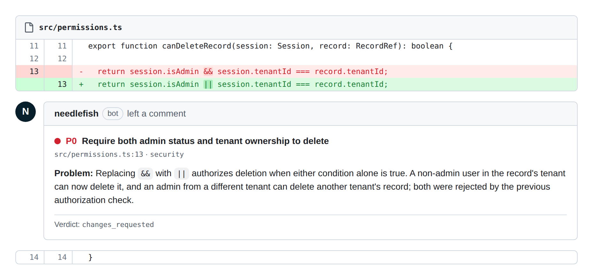

<p align="center">
  
</p>

<p align="center">
  <strong>嚴格、本機的 PR 審查，表現得像資深工程師。</strong><br>
  只標記真正的缺陷，其餘一律保持沉默。
</p>

<p align="center">
  <a href="https://www.npmjs.com/package/needlefish"></a>
  =20">
  <a href="LICENSE"></a>
</p>

<p align="center">
  <a href="#快速開始">快速開始</a> ·
  <a href="#benchmarks">Benchmarks</a> ·
  <a href="#使用方式">使用方式</a> ·
  <a href="#github-action">GitHub Action</a> ·
  <a href="#runners">Runners</a> ·
  <a href="https://github.com/frankekn/needlefish/blob/main/eval/RESULTS.md">方法</a> ·
  <a href="README.md">English</a>
</p>

---

Needlefish 會在 merge 前審查你的 diff，只回報真正的缺陷——錯誤、回歸、
安全性、資料遺失、遷移／升級風險、缺少驗證、重複行為——絕不回報風格
問題。

- **Prefer-zero findings。** 以嚴格資深 reviewer 的標準：不值得阻擋
  merge 的就捨棄。沒有風格挑剔，沒有雜訊。
- **確定性 verdict。** `pass`／`needs_human`／`changes_requested` 由保留
  下來的 finding 依固定規則推導，絕不由模型文字決定。
- **隔離的審查目標。** 審查在 throwaway clean clone 中執行，每次模型呼
  叫後都檢查是否遭竄改。
- **有防護的 evals。** 每次 prompt 或 pipeline 變更上線前，都在 87 個情
  境的 harness（啟用 anti-cheat guard）上量測（見
  [Benchmarks](#benchmarks)）。

小型 PR 會執行審查加對抗式 critic；大型 PR 會先加上 map 與 deep 階段，
再交給相同的 critic。Codex 是預設 runner——也支援 Claude Code、
opencode、OpenAI 相容 HTTP、Grok、pi 與 ACP agent。

<p align="center">
  
</p>

<p align="center">
  <sub>目前部署 lane（GPT-5.6 Terra，high effort）在植入缺陷的 eval fixture 上的真實 finding——<a href="https://github.com/frankekn/needlefish/blob/main/eval/results/2026-09-06-codex-gpt56-terra-high-x3.json">raw report</a>。</sub>
</p>

## 快速開始

**本機**——在要審查的 git repo 內執行。需要 Node 20 以上，以及一個已登
入的 runner CLI（`codex`、`claude` 或 `opencode`）位於 `PATH`：

```bash
npx needlefish
```

**每個 PR**——在目標 repo 新增 `.github/workflows/needlefish.yml`：

```yaml
name: needlefish
on:
  pull_request:
    types: [opened, synchronize, reopened]
permissions:
  contents: read
  pull-requests: write
  checks: write
jobs:
  review:
    # Fork PRs don't receive secrets; skip them instead of failing at model auth.
    if: github.event.pull_request.head.repo.full_name == github.repository
    runs-on: ubuntu-latest
    steps:
      - uses: actions/checkout@v4
        with:
          fetch-depth: 0 # full history: needlefish needs the merge base
      - uses: frankekn/needlefish@v0
        env:
          CODEX_AUTH_JSON: ${{ secrets.CODEX_AUTH_JSON }}
```

設定一個 secret——`CODEX_AUTH_JSON`（已登入 Codex CLI 的
`~/.codex/auth.json` 內容）或 `CODEX_API_KEY`——然後開啟 PR。finding 會
以錨定到 diff 的 inline review comment 送達；後續 push 會就地更新同一
份 review（fresh／still-open／resolved），而不是不斷堆疊新 review。

成本：小型 PR 每次審查 2 次模型呼叫（預設 `gpt-5.6-terra` @ `high`
effort），大型 PR 為 1 次 map + N 次 deep + 1 次 critic。純文件 PR 與未
變更的 head 會完全跳過模型。

## Benchmarks

哪一組 model、agent harness、provider route 與 effort，能抓到真正的 PR
缺陷，又不會阻擋乾淨的變更？下列表格由 `eval/gen-readme.ts` 從與
benchmark 頁面相同的受防護 report JSON 產生；策展過的 chronology 與
confirmation 重跑記錄在
[eval/RESULTS.md](https://github.com/frankekn/needlefish/blob/main/eval/RESULTS.md)。
[Benchmark 頁面](https://frankekn.github.io/needlefish/)
由同樣的受防護 report 產生 leaderboard，絕不手動編輯。

**欄位說明：** **Balanced** 是主要分數——anchored recall 與 usable
specificity 的算術平均。**Tier-1** 是 must-find 缺陷的 recall，也是硬性
資格門檻。**FP** 是被阻擋的乾淨 PR。**Noise/review** 是每次 positive 審
查額外產出的 finding 數（門檻 0.12）。只有 prompt、fixture-set、scorer
hash 與 anti-cheat 版本全部相同的列才能互相比較；provider failure 與訂
閱尚未提供的模型屬於 operational outcome，不是模型的零分。

<!-- benchmark:begin -->
<!-- generated by eval/gen-readme.ts from eval/leaderboard.json and eval/results/*.json — do not hand-edit -->

**更新於 2026-09-07**——量測於 2026-09-06；全部 7 條公開 lane 各跑 87 個情境 × 3 次，包含 sealed holdout，Class R gate，anti-cheat v2；commit `a5a0c68`，prompt `e62d0889fc704541`，fixture set `e9923bbc7753a04a`，scorer `8bbc6152d8b45a43`；每份 report 皆為 `cheatDetectedCount: 0`。

**排名 lane。** **目前部署 lane：GPT-5.6 Terra（`gpt-5.6-terra` @ `high`）**（2026-09-07 選定）——hosted action 與 reusable workflow 的預設。粗體標示目前部署的 lane 與每欄最佳值。

| 名次 | Lane | Harness | Effort | Balanced | 95% CI | Tier-1 | FP | Noise/review | 平均 |
| ---: | --- | --- | --- | ---: | ---: | ---: | ---: | ---: | ---: |
| 1 | [Grok 4.6](https://github.com/frankekn/needlefish/blob/main/eval/results/2026-09-06-grok-grok46-xhigh-x3.json) | Grok CLI 1.0.13 | xhigh | **95.48%** | 92.2%–98.8% | 100% | **1.39%** | **0.011** | 230s |
| 2 | **[GPT-5.6 Terra](https://github.com/frankekn/needlefish/blob/main/eval/results/2026-09-06-codex-gpt56-terra-high-x3.json)（目前部署）** | Codex CLI 0.153.4 | high | 89.95% | 83.8%–96.1% | 100% | 9.72% | 0.077 | **63s** |
| 2 | [GPT-5.6 Sol](https://github.com/frankekn/needlefish/blob/main/eval/results/2026-09-06-codex-gpt56-sol-medium-x3.json) | Codex CLI 0.153.4 | medium | 88.41% | 81.1%–95.7% | 100% | 13.89% | 0.077 | 75s |

**未排名 lane**，同批量測——完整報告只要漏掉任何一次 Tier-1 draw，或 positive noise 超過 0.12，即不給名次；事後 x3 確認僅作記錄，不恢復名次。

| Lane | Balanced | 完整報告未過的門檻 |
| --- | ---: | --- |
| [GLM-5.3-Flash](https://github.com/frankekn/needlefish/blob/main/eval/results/2026-09-06-pi-zai-glm53-flash-max-x3.json) max | 94.81% | Tier-1 95.24%: `real-pr1-self-review-tool-checkout` 2/3 |
| [DeepSeek V4 Flash Vision Exp](https://github.com/frankekn/needlefish/blob/main/eval/results/2026-09-06-pi-cliproxy-deepseek-v4-flash-vision-exp-max-x3.json) max | 91.66% | Tier-1 95.24%: `real-pr1-codex-no-sandbox-flag` 2/3 |
| [GPT-5.6 Terra](https://github.com/frankekn/needlefish/blob/main/eval/results/2026-09-06-codex-gpt56-terra-xhigh-x3.json) xhigh | 90.39% | Tier-1 90.48%: `real-pr1-self-review-tool-checkout` 2/3, `t1-inverted-guard` 2/3; noise 0.1202 > 0.12 |
| [GPT-5.6 Luna](https://github.com/frankekn/needlefish/blob/main/eval/results/2026-09-06-codex-gpt56-luna-max-x3.json) max | 88.43% | Tier-1 76.19%: `t1-inverted-guard` 0/3, `real-pr1-codex-no-sandbox-flag` 2/3, `real-pr1-self-review-tool-checkout` 2/3; noise 0.1311 > 0.12 |
<!-- benchmark:end -->

解讀：Grok 4.6 在準確度與 noise 上領先，但每次審查慢 3.7 倍，且需要
runner 上已登入的 Grok CLI，因此仍維持 candidate。Terra high 與 Sol 在
統計上無法分出高下；Terra high 更快，在乾淨 fixture 上也更乾淨。

**目前部署 lane 變更：Terra xhigh → Terra high**——同模型、同訂閱、同
harness、同批次。粗體標示每列較佳值。

| | xhigh（變更前） | high（目前） | Δ |
| --- | ---: | ---: | ---: |
| Balanced | **90.39%** | 89.95% | −0.4 pt |
| Tier-1 recall | 90.48% | **100%** | +9.5 pt |
| Anchored recall | 86.34% | **89.62%** | +3.3 pt |
| Tier-3 recall | 72.22% | **77.78%** | +5.6 pt |
| Usable specificity | **94.44%** | 90.28% | −4.2 pt |
| 錯誤陽性（72 次 clean draw 中） | **4.17%（3）** | 9.72%（7） | +4 次 draw |
| Positive noise / review | 0.1202 | **0.0765** | −0.0437 |
| 無效輸出 | 0.38% | **0%** | −1 次 draw |
| 平均審查時間 | 80s | **63s** | −21% |

解讀：這次切換以多阻擋四次 clean draw 為代價，換來 Tier-1 完整性、
recall 與速度。Sol medium 原本是名次 2 的替代方案；recall 較高，但
false-positive rate 幾乎是 Terra high 的兩倍。

完整方法、逐 fixture 矩陣與時間序實驗記錄見
[eval/RESULTS.md](https://github.com/frankekn/needlefish/blob/main/eval/RESULTS.md)
與
[RESULTS_HISTORY.md](https://github.com/frankekn/needlefish/blob/main/eval/RESULTS_HISTORY.md)；
raw report 在
[eval/results/](https://github.com/frankekn/needlefish/tree/main/eval/results)。

## 使用方式

本機模式是唯讀的：Markdown 輸出到 stdout，不寫入 GitHub。

**已提交的工作**——在目標 repo 內執行，或從任意位置用 `--repo` 指向
它。預設範圍是 merge-base…`HEAD`（見[基準偵測](#基準偵測)）：

```bash
needlefish --repo /path/to/some-repo
needlefish --repo /path/to/some-repo --focus security
needlefish --repo /path/to/some-repo --deep
needlefish --repo /path/to/some-repo --base develop
needlefish --repo /path/to/some-repo --branch  # force merge-base..HEAD review
```

**未提交的工作**——如果 working tree 是 dirty 的，或 repo 尚無任何
commit，`needlefish` 會審查你未提交的變更，包含 untracked 檔案。還不
是 git repo？先執行 `git init`。

```bash
needlefish --repo /path/to/some-repo --uncommitted  # force working-tree review
```

**Pull request：**

```bash
needlefish --repo /path/to/some-repo --pr 123  # attach PR metadata to the local diff
needlefish pr 123 --repo /path/to/some-repo    # review the PR ref itself
```

**Runner 與 model 選擇：**

```bash
needlefish --repo /path/to/some-repo --runner claude
needlefish --repo /path/to/some-repo --runner opencode --model zai-coding-plan/glm-5.2
NEEDLEFISH_ACP_BIN=/path/to/acp-agent needlefish --repo /path/to/some-repo --runner acp
```

輸出為 stdout 上的 Markdown，同一份 review 會以 JSON 快取在
`~/.cache/needlefish/<repo>/last-review.json`。傳入 `--json` 可改為將
`ReviewResult` JSON 輸出到 stdout：

```bash
needlefish --repo . --json | jq .verdict
```

### 機器介面

`needlefish --repo <path> --json` 與 `needlefish pr <number> --json` 會將
帶版本的 `ReviewResult` JSON 物件輸出到 stdout——與本機快取儲存的物件相
同。在同一個 `schemaVersion` 內，欄位只會新增，絕不修改或移除；破壞性
的 shape 變更需要新的 `schemaVersion` 與 changelog 條目。

| 欄位 | 內容 |
| --- | --- |
| `schemaVersion` | 固定為 `1`。 |
| `verdict` | `pass`、`needs_human` 或 `changes_requested`。 |
| `reviewTarget` | 選用的審查目標字串。 |
| `findings[]` | Finding 物件，含 `severity`、`title`、`category`、`file`、`lineStart`、`lineEnd`、`confidence`、`whyItBreaks`、`suggestedFix` 與 `validation`。 |
| `findings[].consumerFile` | 選用的下游受影響檔案。 |
| `findings[].consumerLine` | 選用的下游受影響行號。 |
| `residualRisks[]` | 殘餘風險物件，含 `text` 與 `blocks`。 |
| `checked[]` | 描述審查內容的證據字串。 |
| `stats` | 選用的逐 runner 呼叫時間與嘗試次數統計。 |
| `totalDurationMs` | 選用的總審查時間（毫秒）。 |

### 基準偵測

`--base` → `origin/HEAD` → `main`。用 `--base <ref>` 覆寫。

## Verdict 推導（確定性）

verdict 是確定性推導的——模型文字絕不決定 pass/fail：

- 任何 P0／P1／P2 finding → `changes_requested`
- 否則有 blocking residual risk → `needs_human`
- 其他情況 → `pass`

只有 P3 的 finding 仍會被報告，但不阻擋（check 維持綠燈）。

## GitHub Action

在每個 PR 上執行有兩種方式：**hosted composite action**（零設定，每次
執行都冷啟動）或 **self-hosted reusable workflow**（低延遲，在你控制的
機器上）。兩者發布相同的結果：非 sticky 的 `COMMENT` review（含完整渲
染的審查本文），加上作為 merge gate 的權威 `Needlefish` check-run。

| verdict              | review event        | check     |
| -------------------- | ------------------- | --------- |
| pass                 | COMMENT             | success   |
| changes_requested    | COMMENT             | failure   |
| needs_human          | COMMENT             | neutral   |
| run failed           | （無）                | failure   |

所有 verdict review 都是 `COMMENT`，絕不是 approval 或 blocking-review
event：`GITHUB_TOKEN` bot 無法正式 approve PR，而 sticky 的 blocking
review 可能比已修復的 head 活得更久。check-run 才是 merge gate——失敗的
review 絕不會讓 PR 過關，因為 check 會是 `failure`。當 finding 帶有驗證
過的精確 replacement 時，其 inline comment 會附上原生 GitHub suggestion
區塊；驗證失敗時退回一般 comment。

### Hosted（任何 repo）

上方快速開始的 workflow 就是全部設定——本 repo 同時是在 GitHub-hosted
`ubuntu-latest` 上執行的 composite action。

**Runner 認證**——repo secret，透過 action step 的 `env` 傳入：

| runner   | secret |
| -------- | ------ |
| codex    | `CODEX_AUTH_JSON`（已登入的 `~/.codex/auth.json` 內容）或 `CODEX_API_KEY` |
| claude   | `ANTHROPIC_API_KEY` |
| opencode | 所選模型的 provider key（例如 `OPENAI_API_KEY`） |
| pi       | `PI_AUTH_JSON`（已登入的 `~/.pi/agent/auth.json` 內容） |

hosted 安裝步驟只接受 `codex`、`claude`、`opencode` 或 `pi`。`grok` 與
`acp` 是 CLI runner，`openai` 是 HTTP——hosted action 都不會安裝，傳入
`runner: grok`（或 `openai`／`acp`）會在該安裝步驟失敗；Grok 4.5 請使
用下方的 self-hosted workflow。Claude 的認證變數（`ANTHROPIC_API_KEY`、
`CLAUDE_CODE_OAUTH_TOKEN`）與 opencode 的 `OPENAI_API_KEY` 在 runner
subprocess 的 allowlist 內；其他 provider 的 key 需要
`NEEDLEFISH_RUNNER_ENV_PASSTHROUGH=VAR`（見
[Runner subprocess 環境](#runner-subprocess-環境)）。

**輸入**（皆可選）：`pr_number`（預設為事件 PR）、`runner`（預設
`codex`）、`model`、`timeout_ms`、`codex_reasoning_effort`、
`runner_version`、`repo_path`（預設為 workspace checkout）、
`github_token`（預設為 workflow token）。

**Runner 版本：** 未設定 `runner_version` 時，action 會安裝 `action.yml`
裡的 per-runner pin（目前 Codex `0.153.4`、Claude `2.1.239`、OpenCode
`1.18.21`、pi `0.70.6`）。單一預設值不可能同時適用四個套件，所以 pin
依所選 `runner` 決定；只有刻意要用其他版本時，才傳入明確版本——或
`latest`。

**成本與行為：**

- 小型 PR：2 次模型呼叫（審查 + critic），使用 workflow 預設值
  `gpt-5.6-terra` @ `high` effort。大型 PR：1 次 map + N 次 deep（預設
  並行數 3）+ 1 次 critic。
- 純文件 PR 與 same-head 重跑花費 0 次模型呼叫（用 `--recheck` 強制重
  新審查）。
- hosted 路徑每次執行都冷啟動（pnpm install + runner CLI 安裝，約一分
  鐘）。下方的 self-hosted 路徑仍是低延遲選項。
- Fork PR 不會收到 secrets，所以快速開始中的 `if:` gate 會跳過它們。
  避免 `pull_request_target`——它會把 secrets 交給由 fork code 觸發的
  workflow。

**留言指令：** composite action 不會把 PR 留言指令加入 consumer repo。
本 repo 的 `.github/workflows/commands.yml` 會監聽維護者（僅
OWNER／MEMBER／COLLABORATOR）的 `@needlefish recheck` 與
`@needlefish explain <finding>` 留言：recheck 會 dispatch 本 repo 的
`review.yml`；explain 在已有 `~/.local/bin/needlefish` 的 self-hosted
runner 上執行 `needlefish explain`。把該檔案複製到其他 repo 之前，必須
先改寫這兩個 job 的目標。

### Self-hosted runner

目標 repo 透過**呼叫本 repo 的 reusable workflow** 來使用 needlefish。
在目標 repo 新增一個薄 caller（例如 `.github/workflows/needlefish.yml`）：

```yaml
name: needlefish
on:
  pull_request:
    types: [opened, synchronize, reopened]
  workflow_dispatch:
    inputs:
      pr_number: { description: PR number to review (manual trigger), required: true }
permissions:
  contents: read
  pull-requests: write
  checks: write
  actions: write
jobs:
  review:
    uses: frankekn/needlefish/.github/workflows/review.yml@main
    with:
      pr_number: ${{ github.event.inputs.pr_number || github.event.pull_request.number }}
      # Optional:
      # runner: codex
      # model: gpt-5.6-terra
      # codex_reasoning_effort: high
      # timeout_ms: "600000"
      # idle_timeout_ms: "600000" # opencode only
    secrets: inherit
```

reconciliation 的 active-run guard 與 pre-check-run retry cap 要求
caller 的 run name 以 PR 編號結尾。請在 caller workflow 的頂層加上：

```yaml
run-name: "needlefish PR #${{ github.event.pull_request.number || inputs.pr_number }}"
```

Closed 或 forked PR 在每個階段都會被跳過：reusable workflow 在
self-hosted job 啟動前跳過；手動與 reusable dispatch 會先解析 PR
metadata，在 checkout 或模型呼叫前跳過；發布任何結果前，CLI 會重新讀
取 PR，若 PR 已關閉或 head SHA 已移動就跳過輸出。

**Grok 4.5：** 將 `runner` 與 `model` override 換成 `runner: grok` 與
`model: grok-4.5`。self-hosted workflow 要求 runner 的 `PATH` 上有已登入
的 `grok` CLI；它不會幫你安裝或登入該 CLI。不改 caller workflow 的一次
性 Grok 審查：

```bash
PR_NUMBER=123 # replace with the PR number
gh workflow run review.yml -R frankekn/needlefish --ref main \
  -f pr_number="$PR_NUMBER" -f runner=grok -f model=grok-4.5
```

**可重現的審查：** 將 reusable workflow 與 `needlefish_release_sha` pin 到
同一個完整 commit SHA：

```yaml
jobs:
  review:
    uses: frankekn/needlefish/.github/workflows/review.yml@<full-commit-sha>
    with:
      needlefish_release_sha: <full-commit-sha>
```

workflow 會直接執行
`~/.local/share/needlefish/releases/<sha>` 的 immutable release，即使較新
的部署已移動共用的 `current` symlink。未明確 pin release 時，會解析
`needlefish_repo` 目前的 `main` SHA。workflow 絕不會在 PR job 中重新安
裝工具——所選 release 必須已部署在 runner 上。

#### Runner 設定（一次性）

1. 在目標 repo 註冊 **self-hosted runner**（免費、不限分鐘數）。保持在
   你控制的機器上（EC2／pod／Mac）。
2. 在該 runner 上部署一次 needlefish。之後推到 `main` 的 push 會執行
   `needlefish-deploy` 並自動更新 runner：
   ```bash
   ssh termtek@ubuntu 'sh -s' < scripts/deploy-ubuntu.sh
   ```
   目前 production fleet 使用一份共用 x64 安裝，加上一份由兩個 runner
   service 共用的 ARM 安裝。兩份安裝都要部署相同的 release SHA，並在信
   任 fleet 前驗證其 installed metadata。
3. 確認 runner 的 `PATH` 上有 `gh` 與所選模型 CLI。Codex fleet 合約是
   `@openai/codex@0.153.4`；以 runner service account 安裝並驗證該確切
   版本：
   ```bash
   npm install --global --prefix "$HOME/.local" @openai/codex@0.153.4
   CODEX_BIN="$HOME/.local/bin/codex"
   test "$("$CODEX_BIN" --version)" = "codex-cli 0.153.4"
   ```
4. 用 `codex_proxy_base_url`、`codex_proxy_required: true` 與
   `codex_proxy_api_key` workflow secret 把 Codex 的 proxy route 提供給
   reusable workflow。`pull_request` 事件不帶 workflow input，所以本
   repo 自己的 review 要另外設定 repository variable
   `CODEX_PROXY_BASE_URL` 與該 secret；input 缺席時 workflow 會退回使用
   這個變數。Needlefish 會在命令列註冊 `cliproxyapi` custom provider，
   而 credential 只存在子程序環境；required 模式會拒絕不完整的設定，而
   不是退回 OAuth。Proxy invocation 會省略 direct-subscription 的
   `service_tier` override。Grok 則依 provider 完成 CLI 登入或 key 設
   定，並確認 `grok` 能以 runner service account 執行。
5. 若 needlefish 是 **private**，caller repo 必須被允許呼叫此 reusable
   workflow；否則（public）預設的 `GITHUB_TOKEN` 就足夠。
6. **Runner global-instructions 注意事項：** 模型 CLI 可能自動載入
   runner home 目錄的 global instructions。Needlefish 會指示模型只把目
   標 repo 的 `AGENTS.md` 當作政策，忽略其他來源；但若要零洩漏，請保
   持 runner home 沒有不相關的 instruction 檔案。

所有 production 模型 runner 執行時都不套用各自 process-level 的權限限
制。請只在你控制的 self-hosted runner 上使用。

> Self-hosted runner 會在你的機器上執行 PR code。只在自己的 repo 單獨使
> 用沒問題；若未來開放外部 contributor 的 PR，請隔離 runner（ephemeral
> container），讓 contributor code 無法觸及你的持久化主機。

## Runners

`--runner`／`NEEDLEFISH_RUNNER` 可為 `codex`、`claude`、`opencode`、
`openai`、`grok`、`pi` 或 `acp`；`src/shared/codex.ts` 負責呼叫所選
runner。共通選項：

| 選項 | 環境變數 | 預設 |
| --- | --- | --- |
| runner | `NEEDLEFISH_RUNNER` | 依序自動偵測 `codex`、`claude`、`opencode` |
| model | `NEEDLEFISH_MODEL` | runner 預設值 |
| Codex reasoning effort | `CODEX_REASONING_EFFORT` | `medium`（composite action 與 reusable workflow：`gpt-5.6-terra` 時為 `high`） |
| timeout | `NEEDLEFISH_TIMEOUT_MS` | `600000` |
| opencode idle timeout | `OPENCODE_IDLE_TIMEOUT_MS` | per-call timeout 與 `600000` 中較小者 |

opencode 的 idle deadline 在 CLI 每次產生 stdout 或 stderr 時重設。若
provider stream 停止產生輸出，Needlefish 會終止該 attempt 並使用既有的
runner retry，而不是苦等被拉長的 per-call timeout。

當 `--runner` 與 `NEEDLEFISH_RUNNER` 都未設定，且找不到 `codex`、
`claude` 或 `opencode` 時，Needlefish 會輸出這三個 CLI 的安裝指令後結
束，而不是丟出 stack trace。自動偵測不會尋找 `grok`、`pi`、`openai` 或
`acp`。

各 runner 的環境變數。CLI runner 的 binary／model／所列認證變數都在該
runner 的 subprocess allowlist 內。`openai` runner 是 HTTP，在 process
內讀取環境變數（其 subprocess allowlist 為空）。括號內是未設定 `*_BIN`
變數時使用的執行檔名：

| runner | binary | model／其他 |
| --- | --- | --- |
| `codex` | `CODEX_BIN`（`codex`） | `CODEX_MODEL`、`CODEX_TIMEOUT_MS`、`CODEX_RETRY_MS`、`CODEX_REASONING_EFFORT`；proxy `CODEX_PROXY_BASE_URL`、`CODEX_PROXY_API_KEY`、`NEEDLEFISH_CODEX_PROXY_REQUIRED=1` |
| `claude` | `CLAUDE_BIN`（`claude`） | `CLAUDE_MODEL`；認證 `ANTHROPIC_API_KEY`、`CLAUDE_CODE_OAUTH_TOKEN` |
| `opencode` | `OPENCODE_BIN`（`opencode`） | `OPENCODE_MODEL`；認證 `OPENAI_API_KEY` |
| `grok` | `GROK_BIN`（`grok`） | `GROK_MODEL` |
| `pi` | `PI_BIN`（`pi`） | `PI_MODEL`、`PI_PROVIDER`（預設 `openai-codex`）、`PI_AUTH_MODE`（`oauth` 或 `proxy`；`openai-codex` 預設 OAuth，明確指定 provider 時預設 proxy） |
| `acp` | `NEEDLEFISH_ACP_BIN`（必填） | — |
| `openai` | 無（HTTP，不是 CLI） | `OPENAI_API_KEY`（必填）、`--model`／`OPENAI_MODEL`（必填）、`OPENAI_BASE_URL`（預設 `https://api.openai.com/v1`） |

### 各 runner 的啟動方式

- **Codex：** `--ignore-user-config --ignore-rules
  --dangerously-bypass-approvals-and-sandbox`，使其檢查命令不會被
  execpolicy rule、approval prompt 或 host sandbox 阻擋。Reasoning
  effort 預設為 `medium`；設 `CODEX_REASONING_EFFORT=high` 可恢復舊預
  設，`xhigh` 為最高 effort 模式。
- **Claude Code：** `--dangerously-skip-permissions`、`--safe-mode` 與
  `--no-session-persistence`。
- **Grok：** `--always-approve --permission-mode bypassPermissions
  --no-plan --sandbox off`。
- **opencode：** headless 模式的 `--auto`，並以 inline `permission:
  "allow"` override 其 global 與 build-agent 權限。
- **pi：** `--no-session --mode text --provider openai-codex --thinking
  <level>` 與預設完整 toolset。
- **ACP：** 從 `NEEDLEFISH_ACP_BIN` 以 stdio 執行的 JSON-RPC 2.0 Agent
  Client Protocol process。timeout 時 Needlefish 會先送
  `session/cancel`，再套用與 CLI runner 相同的 process-group kill 路徑。

每個 CLI runner 都在審查 head commit 的 **throwaway clean clone** 內執
行，GitHub token 已移除，並固定預期的 `HEAD`。每次成功的模型呼叫後，
Needlefish 會用 `git status
--porcelain --untracked-files=all --ignored=matching` 重新檢查 clone，驗
證 `HEAD` 沒有移動，並拒絕任何 worktree 變更。clone 不帶 remote：其
`origin`（本會指向同一檔案系統上的原始 repo）會在 runner 啟動前移除，
因此從 sandbox 內執行一般的 `git push` 無法在原始 repo 建立、強制更新
或刪除 branch。這只關閉現成的 push 路徑；它不是 OS 層級的邊界，知道
原始路徑的 runner 仍可直接寫入該處。Closed PR 會在 diff 或模型呼叫前
被跳過。

### Runner subprocess 環境

Runner CLI（`codex`、`claude`、`opencode`、`grok`、`pi`、`acp`）以
allowlist 環境啟動，而非完整的 parent `process.env`——只有
locale／proxy／path 基礎變數加上各 runner 自己的 `_BIN`／`_MODEL` 類變
數會被傳入。若要額外傳遞變數給 runner subprocess，設定
`NEEDLEFISH_RUNNER_ENV_PASSTHROUGH=VAR1,VAR2`（逗號分隔的名稱）。在
GitHub Actions 上，非機密的 `RUNNER_TRACKING_ID` job marker 會保留，讓
self-hosted runner 在 job 被取消時能終止 detached model process。

ACP 環境認證還需要明確的 credential 宣告：將
`NEEDLEFISH_ACP_AUTH_ENV_VARS` 設為 credential 名稱，並把相同名稱列入
`NEEDLEFISH_RUNNER_ENV_PASSTHROUGH`——例如
`NEEDLEFISH_ACP_AUTH_ENV_VARS=MY_AGENT_TOKEN` 搭配
`NEEDLEFISH_RUNNER_ENV_PASSTHROUGH=MY_AGENT_TOKEN`。任意 passthrough 設
定本身不能證明已認證。或者，將 `NEEDLEFISH_ACP_AUTH_FILES` 設為逗號分
隔的 HOME 相對 credential 檔案；Needlefish 只會把這些檔案複製到
disposable runner HOME。

## 開發環境安裝

需要 Node 20 以上、Corepack（建議）或 `packageManager` 指定的 pnpm、一
個本機已登入的支援模型 CLI（Codex、Claude Code 或 opencode），以及
GitHub CLI（`gh`，供 `--pr`、`pr` 與 GitHub Action 模式使用）。

```bash
git clone https://github.com/frankekn/needlefish
cd needlefish
PNPM_VERSION=$(node -p "require('./package.json').packageManager")
corepack enable
corepack prepare "$PNPM_VERSION" --activate
pnpm install --frozen-lockfile
```

若沒有 Corepack，直接安裝指定的 package manager：

```bash
PNPM_VERSION=$(node -p "require('./package.json').packageManager")
npm exec --yes --package "$PNPM_VERSION" -- pnpm install --frozen-lockfile
```

**PATH 上的開發 shim（選用）：** repo 內含 `bin/needlefish` 開發 shim。把
它 symlink 到 PATH 內的目錄，就能從任何 cwd 呼叫 `needlefish`：

```bash
ln -sf "$PWD/bin/needlefish" ~/.local/bin/needlefish   # or any PATH dir
needlefish --version
```

shim 會解析 symlink，並用 repo 內的 `tsx` 執行 `src/cli.ts`，因此即使
repo 是從別處 link 過來的也能運作，也適用於非互動 shell（不像 shell
alias）。不做此步驟時，請用完整路徑呼叫：
`/path/to/needlefish/node_modules/.bin/tsx /path/to/needlefish/src/cli.ts`
（cwd 為目標 repo）。

## 狀態

v0.4.3。唯讀。已提供:inline review comment、sticky 重審(跨 push 的
fresh／open／resolved）、純文件 fast path（不呼叫模型）、same-head
dedupe、hosted-runner repo inspection（best-effort AppArmor sysctl）。
`--fix` 依設計維持未實作。維護者 `@needlefish recheck`／`@needlefish
explain` 留言指令存在於本 repo 的 `.github/workflows/commands.yml`；已發
布的 composite action 不會安裝該 workflow。
